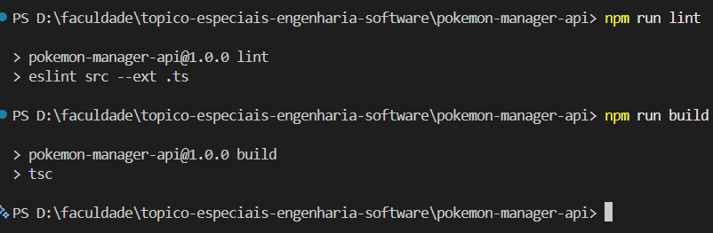
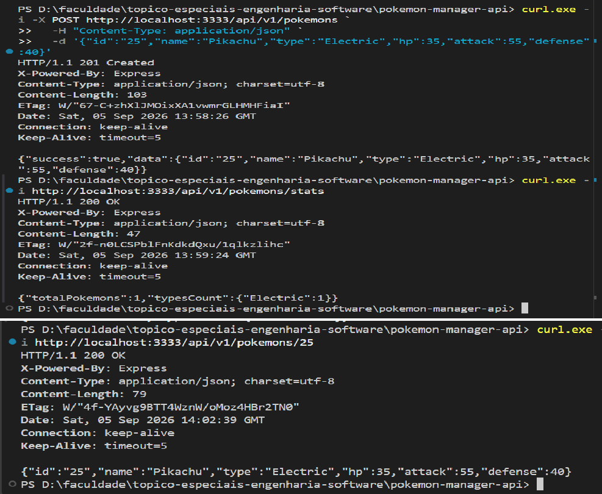
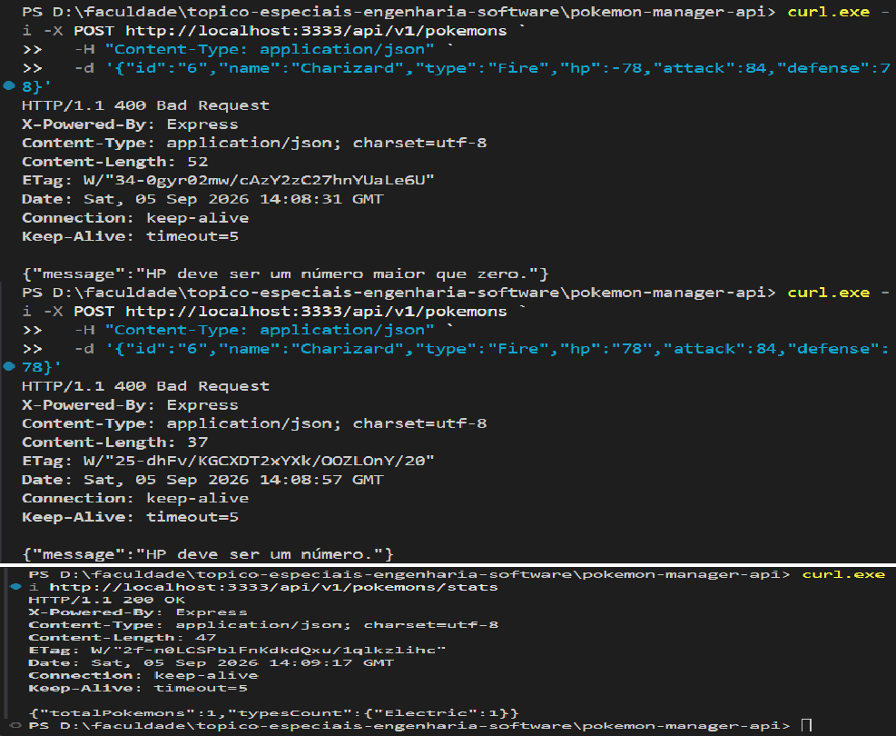
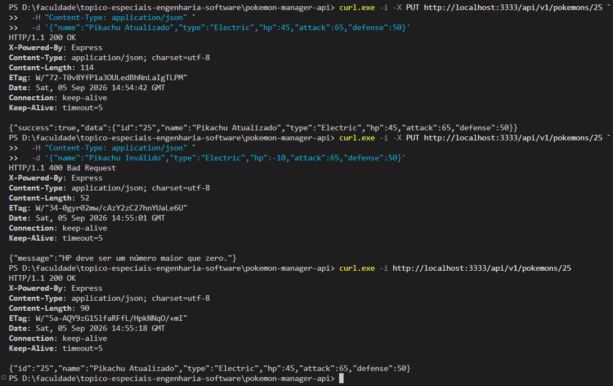
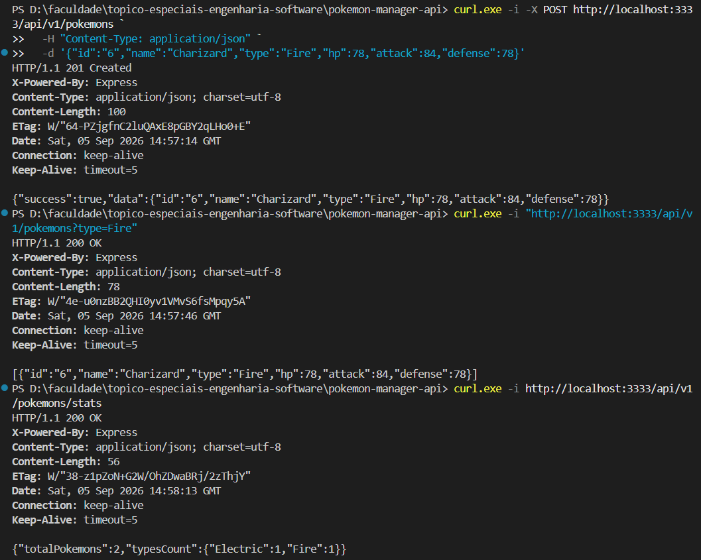
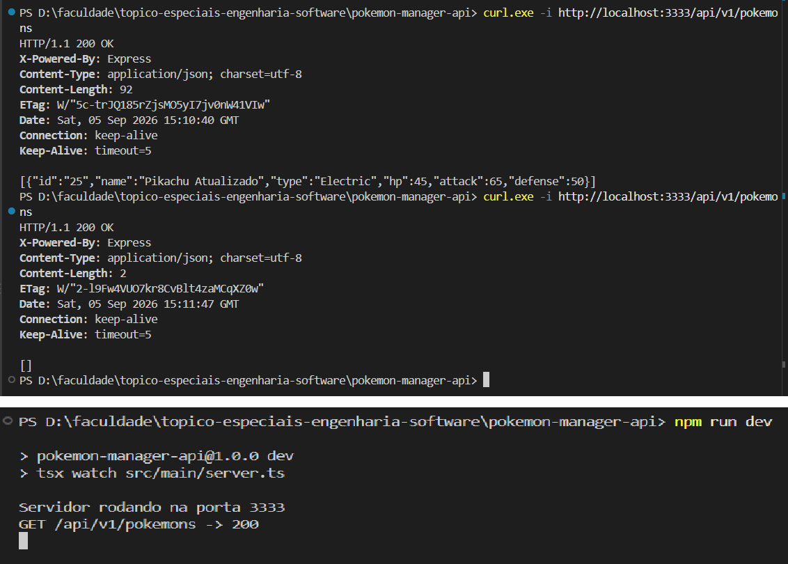

# PokéManager API

Projeto desenvolvido para a disciplina **Tópicos Especiais em Engenharia de Software**, com foco na evolução prática dos conteúdos estudados ao longo das Aulas 1 a 4.

**Aluno:** Claudio R Nunes  
**Curso:** Ciências da Computação

## Entrega 1 — Arquitetura e Contrato REST

A primeira entrega consolida uma API REST para gerenciamento de um catálogo de Pokémon utilizando **TypeScript**, **Express**, **Clean Architecture** e um repositório **In-Memory**.

O objetivo desta etapa não é antecipar tecnologias das próximas entregas, mas demonstrar de forma clara:

- organização em camadas;
- separação de responsabilidades;
- uso de contratos por interfaces;
- inversão de dependência;
- entidade de domínio com regras próprias;
- casos de uso independentes de HTTP;
- Controller e Routes como adaptação para a Web;
- contrato REST com verbos, parâmetros, query strings, body JSON e códigos HTTP;
- armazenamento em memória durante a execução da aplicação;
- tipagem TypeScript e validação básica em runtime.

---

## 1. Evolução do projeto nas Aulas 1 a 4

O código atual é resultado da evolução do mesmo projeto. Alguns exercícios intermediários foram transformados ou substituídos quando conceitos posteriores passaram a organizar melhor a aplicação.

### Aula 1 — Preparação do projeto e arquitetura

A primeira aula estabeleceu a base do projeto:

- Node.js e npm;
- TypeScript em modo estrito;
- execução durante o desenvolvimento com `tsx`;
- ESLint e Prettier;
- estrutura inicial inspirada em Clean Architecture;
- separação entre `domain`, `application`, `infrastructure` e `main`.

A partir desta aula, o projeto deixou de ser apenas um conjunto de funções e passou a ter uma organização explícita de responsabilidades.

### Aula 2 — TypeScript, tipos e contratos

A segunda aula aprofundou recursos do TypeScript e a diferença entre JavaScript executado em runtime e os tipos verificados durante o desenvolvimento/compilação.

Entre os conceitos exercitados estavam:

- `interface`;
- `enum`;
- Union Types;
- tipagem de parâmetros e corpo de requisição;
- contratos de repositório;
- implementação simulada/In-Memory.

Durante essa etapa foram usados modelos intermediários, como `Rarity`, `nickname` e um DTO de Trainer. Eles cumpriram finalidade pedagógica, mas não permaneceram no código final porque o modelo da Aula 4 evoluiu para os atributos atualmente utilizados pela entidade `Pokemon`.

### Aula 3 — HTTP, REST e Express

A terceira aula introduziu a camada Web:

- requisição e resposta HTTP;
- aplicação stateless;
- JSON;
- Express;
- verbos `GET`, `POST`, `PUT` e `DELETE`;
- códigos HTTP;
- parâmetros de rota;
- query strings;
- endpoint de estatísticas.

O endpoint `/stats`, criado nesta etapa, foi preservado e posteriormente migrado para a arquitetura da Aula 4.

### Aula 4 — Clean Architecture aplicada ao CRUD

A quarta aula consolidou a arquitetura atual:

- entidade `Pokemon` no domínio;
- `IPokemonRepository` como contrato;
- `InMemoryPokemonRepository` como implementação concreta;
- Use Cases para as operações da aplicação;
- `PokemonController` para traduzir HTTP para casos de uso;
- Routes responsáveis pelo mapeamento de endpoints;
- `main` como ponto de composição das dependências.

O CRUD final passou a ser executado sem que os casos de uso conheçam Express ou a implementação concreta do armazenamento.

---

## 2. Estrutura do projeto

```text
src/
├── domain/
│   ├── entities/
│   │   └── pokemon.ts
│   ├── errors/
│   │   └── resource-not-found-error.ts
│   └── repositories/
│       └── pokemon-repository.ts
│
├── application/
│   ├── dtos/
│   │   └── pokemon-dto.ts
│   └── use-cases/
│       ├── create-pokemon.ts
│       ├── delete-pokemon.ts
│       ├── get-pokemon-by-id.ts
│       ├── get-pokemon-stats.ts
│       ├── list-pokemons.ts
│       └── update-pokemon.ts
│
├── infrastructure/
│   ├── database/
│   │   └── in-memory/
│   │       └── in-memory-pokemon-repository.ts
│   └── http/
│       ├── controllers/
│       │   └── pokemon-controller.ts
│       └── routes/
│           └── pokemon-routes.ts
│
└── main/
    ├── factories/
    │   └── make-pokemon-controller.ts
    └── server.ts
```

A dependência entre as partes pode ser resumida assim:

```text
Cliente HTTP
    ↓
Express / Routes
    ↓
PokemonController
    ↓
Use Cases
    ↓
IPokemonRepository
    ↑
InMemoryPokemonRepository
```

O `main` funciona como ponto de composição: cria o Controller por meio da factory e entrega essa dependência às rotas.

```text
main/server.ts
    ├── makePokemonController()
    └── createPokemonRoutes(controller)
```

Dessa forma, `infrastructure/http/routes` não precisa importar `main`.

---

## 3. Conceitos de Orientação a Objetos usados no projeto

### Classe, interface, entidade e instância

Esses termos aparecem juntos no projeto, mas representam coisas diferentes.

#### Interface

Uma interface descreve uma estrutura ou contrato.

Exemplo:

```ts
export interface PokemonProps {
  id: string;
  name: string;
  type: PokemonType;
  hp: number;
  attack: number;
  defense: number;
}
```

Já `IPokemonRepository` descreve quais operações qualquer repositório de Pokémon deve oferecer.

#### Classe

`Pokemon` é uma classe porque contém atributos, construtor, métodos e regras de implementação.

#### Entidade

`Pokemon` também representa uma entidade de domínio, pois corresponde a um conceito importante para a aplicação e possui identidade própria por meio de `id`.

#### Instância

Quando é executado:

```ts
const pokemon = new Pokemon(input);
```

é criada uma instância concreta da classe `Pokemon`.

---

## 4. Encapsulamento da entidade `Pokemon`

A entidade mantém seus atributos mutáveis privados:

```ts
private _name: string;
private _type: PokemonType;
private _hp: number;
private _attack: number;
private _defense: number;
```

A leitura é feita por getters públicos, mas a alteração conjunta do estado ocorre pelo método `update()`.

```ts
pokemon.update({
  name: input.name,
  type: input.type,
  hp: input.hp,
  attack: input.attack,
  defense: input.defense,
});
```

Antes de modificar qualquer atributo, o método valida todos os novos valores. Isso evita uma atualização parcial da entidade.

```text
novos dados
    ↓
valida todos os valores
    ↓
┌───────────────┬───────────────┐
│ algum inválido│ todos válidos │
│               │               │
│ lança Error   │ altera estado │
│ nada é alterado│ por completo │
└───────────────┴───────────────┘
```

Essa decisão foi validada manualmente durante os testes: um `PUT` com HP inválido foi rejeitado e a entidade preservou integralmente o estado anterior.

O `id` é `readonly`, pois identifica a entidade e não deve ser alterado após sua criação.

---

## 5. Contrato e inversão de dependência

O domínio define o contrato:

```ts
export interface IPokemonRepository {
  findAll(): Promise<Pokemon[]>;
  findByType(type: string): Promise<Pokemon[]>;
  findById(id: string): Promise<Pokemon | null>;
  create(pokemon: Pokemon): Promise<void>;
  update(pokemon: Pokemon): Promise<void>;
  delete(id: string): Promise<void>;
}
```

A implementação concreta fica na Infrastructure:

```ts
export class InMemoryPokemonRepository implements IPokemonRepository {
  // armazenamento em memória
}
```

Os Use Cases recebem a interface, e não a classe concreta:

```ts
constructor(private pokemonRepository: IPokemonRepository) {}
```

Assim:

```text
Use Case
   ↓
IPokemonRepository
   ↑
InMemoryPokemonRepository
```

O caso de uso sabe **o que** um repositório precisa fazer, mas não precisa saber **como** os dados são armazenados.

Esse é o principal exemplo de inversão de dependência utilizado nesta entrega.

---

## 6. Separação de responsabilidades

Cada parte possui uma responsabilidade predominante:

| Parte | Responsabilidade |
|---|---|
| `Pokemon` | representar a entidade e proteger suas regras de estado |
| Use Cases | executar as ações da aplicação |
| `IPokemonRepository` | definir o contrato de armazenamento |
| `InMemoryPokemonRepository` | armazenar e recuperar dados em memória |
| `PokemonController` | traduzir requisição HTTP para Use Case e resultado para resposta HTTP |
| Routes | associar verbo + endpoint ao método do Controller |
| Main / Factory | criar e conectar as dependências |

Uma forma prática de identificar responsabilidade é perguntar:

> Se esta regra mudar, qual parte deveria precisar mudar?

Por exemplo, trocar o mecanismo de armazenamento não deveria exigir reescrever os Use Cases.

---

## 7. Controller, Routes e Express

O Express é responsável por receber e responder requisições HTTP.

No `server.ts`:

```ts
const app = express();

app.use(express.json());
```

`express.json()` interpreta o corpo JSON recebido e o disponibiliza em `req.body`.

O fluxo de uma requisição é:

```text
Cliente
  ↓ HTTP
Express
  ↓
Route
  ↓
Controller
  ↓
Use Case
  ↓
Repository
```

O Use Case não conhece `Request`, `Response`, `res.status()` ou qualquer outro recurso do Express. Essa tradução pertence ao Controller.

---

## 8. Params, Query e Body

A API utiliza três formas diferentes de receber informações.

### Route Params

Usado para identificar um recurso específico.

```http
GET /api/v1/pokemons/25
```

No Controller:

```ts
req.params.id
```

### Query String

Usada para filtrar a listagem.

```http
GET /api/v1/pokemons?type=Fire
```

No Controller:

```ts
req.query.type
```

### Body JSON

Usado principalmente em `POST` e `PUT`.

```json
{
  "id": "25",
  "name": "Pikachu",
  "type": "Electric",
  "hp": 35,
  "attack": 55,
  "defense": 40
}
```

---

## 9. TypeScript e validação em runtime

Os DTOs documentam e tipam o formato esperado pelo código TypeScript:

```ts
export interface CreatePokemonDTO {
  id: string;
  name: string;
  type: PokemonType;
  hp: number;
  attack: number;
  defense: number;
}
```

Essa tipagem ajuda o programador e o compilador, mas não impede um cliente HTTP de enviar dados incorretos.

Por isso há duas responsabilidades diferentes.

### Validação básica da entrada HTTP

O Controller verifica aspectos estruturais, por exemplo:

- `id` e `name` como strings válidas;
- `type` como string recebida;
- `hp`, `attack` e `defense` como números.

### Regras da entidade

A entidade verifica regras que fazem parte de um Pokémon válido:

- nome não vazio;
- tipo pertencente ao `PokemonType`;
- HP maior que zero;
- ataque maior que zero;
- defesa maior que zero.

Assim:

```text
Controller
"A entrada possui a estrutura básica esperada?"
       ↓
Use Case
"A operação pode ser realizada?"
       ↓
Pokemon
"O estado da entidade é válido?"
```

Um exemplo dos testes realizados:

```text
hp = "78"
→ problema de tipo na entrada HTTP

hp = -78
→ número recebido corretamente
→ viola regra da entidade
```

---

## 10. Repositório In-Memory

O repositório atual utiliza um array:

```ts
private pokemons: Pokemon[] = [];
```

A factory mantém uma única instância durante a execução da aplicação:

```ts
const pokemonRepository = new InMemoryPokemonRepository();
```

Isso permite que diferentes requisições compartilhem o mesmo catálogo enquanto o processo Node está ativo.

```text
POST Pikachu
    ↓
Pokemon[] contém Pikachu
    ↓
GET /25 encontra Pikachu
```

Porém, os dados não são persistidos de forma permanente.

```text
processo ativo
→ dados permanecem em memória

servidor reiniciado
→ nova memória
→ catálogo vazio
```

Esse comportamento foi comprovado na bateria manual de testes.

### Stateless não significa ausência de armazenamento

HTTP ser stateless significa que cada requisição deve conter as informações necessárias para ser compreendida. Isso não impede que o servidor mantenha dados.

Portanto:

```text
HTTP stateless
≠
servidor sem armazenamento
```

---

## 11. Contrato REST da Entrega 1

Base URL:

```text
http://localhost:3333/api/v1/pokemons
```

| Método | Endpoint | Finalidade | Sucesso | Erros principais |
|---|---|---|---:|---:|
| `GET` | `/api/v1/pokemons` | listar todos | `200` | — |
| `GET` | `/api/v1/pokemons?type=Fire` | filtrar por tipo | `200` | — |
| `GET` | `/api/v1/pokemons/stats` | estatísticas do catálogo | `200` | — |
| `GET` | `/api/v1/pokemons/:id` | buscar por ID | `200` | `404`, `500` |
| `POST` | `/api/v1/pokemons` | cadastrar | `201` | `400`, `500` |
| `PUT` | `/api/v1/pokemons/:id` | atualizar | `200` | `400`, `404`, `500` |
| `DELETE` | `/api/v1/pokemons/:id` | excluir | `204` | `404`, `500` |

### Observação sobre `/stats`

A rota `/stats` é registrada antes de `/:id` para que a palavra `stats` não seja interpretada pelo Express como um identificador de Pokémon.

---

## 12. Exemplos de uso

Os exemplos abaixo usam PowerShell com `curl.exe`.

### Listar Pokémon

```powershell
curl.exe -i http://localhost:3333/api/v1/pokemons
```

### Buscar por ID

```powershell
curl.exe -i http://localhost:3333/api/v1/pokemons/25
```

### Filtrar por tipo

```powershell
curl.exe -i "http://localhost:3333/api/v1/pokemons?type=Electric"
```

### Consultar estatísticas

```powershell
curl.exe -i http://localhost:3333/api/v1/pokemons/stats
```

### Criar

```powershell
curl.exe -i -X POST http://localhost:3333/api/v1/pokemons `
  -H "Content-Type: application/json" `
  -d '{"id":"25","name":"Pikachu","type":"Electric","hp":35,"attack":55,"defense":40}'
```

### Atualizar

```powershell
curl.exe -i -X PUT http://localhost:3333/api/v1/pokemons/25 `
  -H "Content-Type: application/json" `
  -d '{"name":"Pikachu Atualizado","type":"Electric","hp":45,"attack":65,"defense":50}'
```

### Excluir

```powershell
curl.exe -i -X DELETE http://localhost:3333/api/v1/pokemons/25
```

---

## 13. Como executar o projeto

Instale as dependências:

```powershell
npm install
```

Execute a análise estática:

```powershell
npm run lint
```

Compile o TypeScript:

```powershell
npm run build
```

Inicie o servidor de desenvolvimento:

```powershell
npm run dev
```

O projeto utiliza `tsx watch`, permitindo executar o código TypeScript durante o desenvolvimento e reiniciar o servidor automaticamente quando os arquivos são alterados.

Servidor:

```text
http://localhost:3333
```

---

## 14. Ferramentas utilizadas nesta etapa

| Ferramenta | Papel no projeto |
|---|---|
| Node.js | ambiente de execução JavaScript |
| npm | gerenciamento de dependências e scripts |
| npx | execução direta de ferramentas instaladas no projeto |
| TypeScript | tipagem estática e compilação |
| tsx | execução do TypeScript durante o desenvolvimento |
| Express | camada HTTP da API |
| ESLint | análise de qualidade e regras de código |
| Prettier | padronização de formatação |
| Git / GitHub | versionamento e armazenamento do repositório |

---

## 15. Bateria manual de testes

Após a revisão técnica da Entrega 1, foi executada uma bateria manual cobrindo o contrato REST e comportamentos importantes da arquitetura.

| Evidência | Cenário | Resultado |
|---:|---|---|
| 01 | Lint e Build | aprovado |
| 02 | Inicialização da API | aprovado |
| 03 | Estado inicial e `/stats` vazio | aprovado |
| 04 | Criação, consulta e estado compartilhado em memória | aprovado |
| 05 | Rejeição de ID duplicado | aprovado |
| 06 | Validação de entrada e regras de domínio | aprovado |
| 07 | Atualização e encapsulamento da entidade | aprovado após correção encontrada pelos testes |
| 08 | Filtro por tipo e estatísticas | aprovado |
| 09 | GET, PUT e DELETE de recurso inexistente | `404` conforme esperado |
| 10 | Exclusão válida e atualização do catálogo | aprovado |
| 11 | Perda dos dados após reinício do servidor In-Memory | comportamento esperado |

### Uma falha encontrada durante a bateria

A primeira versão do método `Pokemon.update()` alterava propriedades antes de terminar todas as validações. Quando um valor posterior era inválido, a operação lançava erro, mas parte da entidade já havia sido modificada.

O teste manual identificou esse comportamento. A implementação foi corrigida para:

1. validar todos os novos valores;
2. somente depois modificar o estado da entidade.

A bateria foi repetida e confirmou que uma atualização inválida não deixa alterações parciais.

Esse caso também mostra a diferença entre:

```text
lint/build
→ verificam qualidade estática e compilação

bateria funcional
→ verifica comportamento real da aplicação
```

---

## 16. Evidências selecionadas

### Lint e Build



### Criação, consulta e estado em memória



### Validação da entrada e regras de domínio



### Atualização e encapsulamento



### Filtro por tipo e estatísticas



### Comportamento In-Memory



As demais evidências da bateria permanecem disponíveis na pasta `img/`.

---

## 17. Guia rápido para apresentação

Uma sequência simples para apresentar a Entrega 1 é:

### 1. Começar pelo objetivo

Explicar que a entrega demonstra uma API REST com arquitetura em camadas e armazenamento In-Memory.

### 2. Mostrar a estrutura de pastas

Apontar:

```text
Domain → regras e contratos
Application → casos de uso
Infrastructure → implementação técnica e HTTP
Main → composição
```

### 3. Usar `Pokemon` para explicar OO

Mostrar:

- atributos privados;
- `id` somente leitura;
- getters;
- método `update()`;
- validações antes da alteração de estado.

Relacionar:

```text
PokemonProps → interface
Pokemon → classe e entidade
new Pokemon(...) → instância
```

### 4. Usar o repositório para explicar contrato e inversão

Mostrar que o Use Case depende de:

```ts
IPokemonRepository
```

e não de:

```ts
InMemoryPokemonRepository
```

### 5. Mostrar o fluxo de uma requisição

```text
Route
↓
Controller
↓
Use Case
↓
Repository
```

Explicar que o Use Case não conhece Express.

### 6. Mostrar o contrato REST

Usar exemplos de:

- `GET` para consulta;
- `POST` para criação;
- `PUT` para atualização;
- `DELETE` para exclusão;
- `params`, `query` e `body`.

### 7. Mostrar uma evidência de validação

A Evidência 07 é especialmente útil porque demonstra que um `PUT` inválido retorna `400` sem corromper o estado anterior da entidade.

### 8. Encerrar com In-Memory

Explicar que:

```text
mesmo processo → dados permanecem
reinício → dados são perdidos
```

Isso prepara naturalmente a motivação para a etapa futura de persistência, sem antecipar sua implementação.

---

## 18. Escopo das próximas entregas

As tecnologias abaixo fazem parte do planejamento da disciplina, mas **não estão implementadas nesta Entrega 1**.

| Entrega | Tema | Planejamento | Data final |
|---|---|---|---|
| **1** | Arquitetura e Contrato REST | Clean Architecture, In-Memory e REST | **10/09/2026** |
| 2 | Persistência e Integrações | persistência relacional, Zod e PokéAPI | 08/10/2026 |
| 3 | Segurança | JWT, RBAC e práticas OWASP | 05/11/2026 |
| 4 | Qualidade, CI/CD e Cloud | Docker, testes automatizados, CI/CD e Cloud Deploy | 03/12/2026 |

A separação atual por contratos e camadas prepara o projeto para essas evoluções sem exigir que elas sejam antecipadas nesta entrega.

---

## 19. Estado da Entrega 1

Ao final da revisão e da bateria manual:

- estrutura da Clean Architecture consolidada;
- regra de dependência revisada;
- CRUD REST funcional;
- `/stats` preservado e integrado à arquitetura atual;
- entidade `Pokemon` encapsulada;
- atualização protegida contra estado parcial inválido;
- entrada HTTP tipada e validada em runtime no nível básico;
- erros `400` e `404` verificados;
- repositório In-Memory validado durante execução e após reinício;
- lint e build verificados;
- evidências registradas para documentação e apresentação.

**Entrega 1 consolidada: Arquitetura e Contrato REST.**
